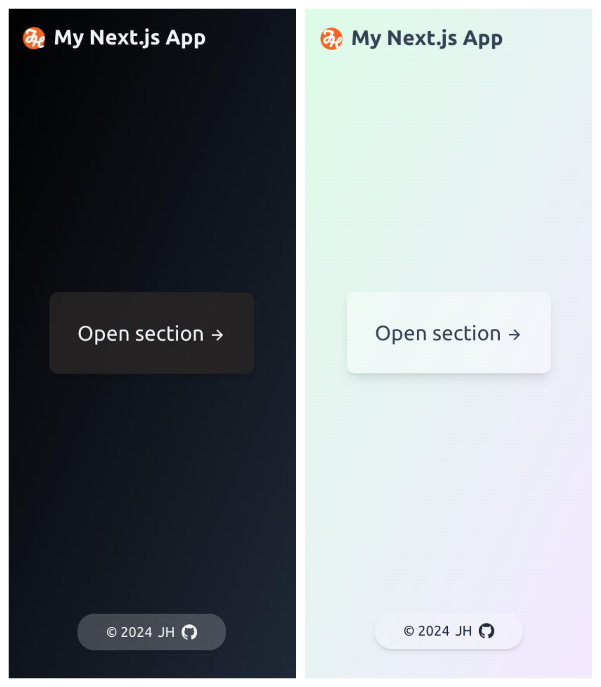

<h1 align="center">Your Next.js Template by
    
</h1>

    
    
    
    
    
    

## Summary
This is my go-to template for quickly bootstraping a Next.js project. It includes the following features:
#### CSS
- [x] Dark mode support
- [x] Mobile-first responsive design
- [x] Theme colour support
- [x] Themed scrollbar support

#### Components
- [x] Basic header + footer
- [x] Routing example (`/section`)
- [x] API example (`/api/hello`)
- [x] Reusable layout component (`HomeLayout.tsx`)

## What it looks like
</img>

## License
Copyright @[Jarrett Huang](https://github.com/jarretthuang), under the [MIT License](https://github.com/jarretthuang/json-viewer/blob/main/LICENSE).
